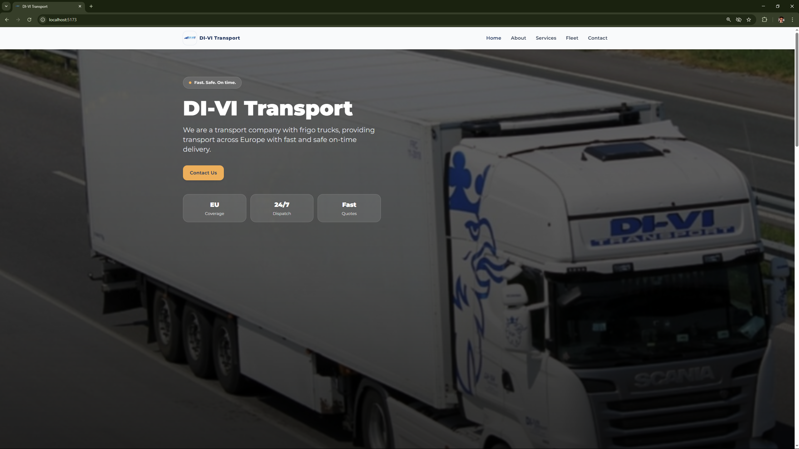
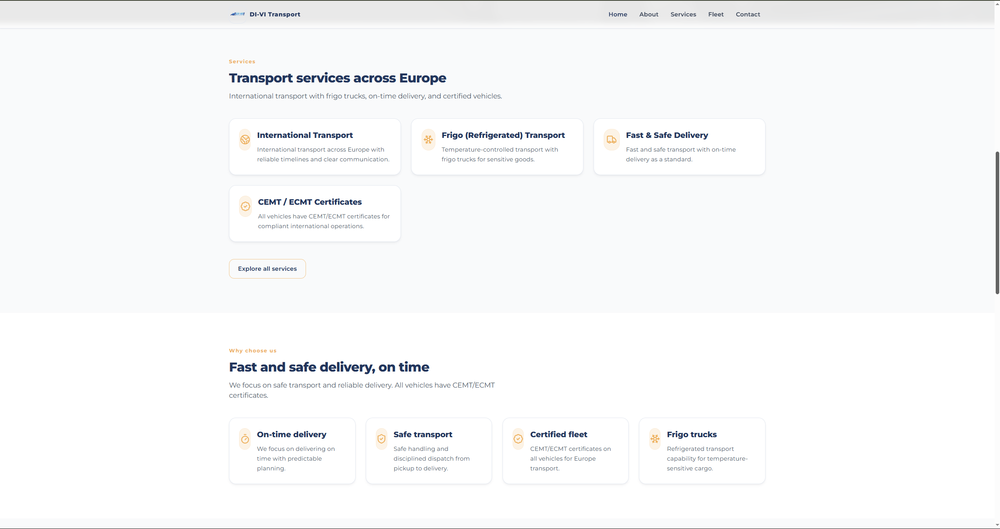
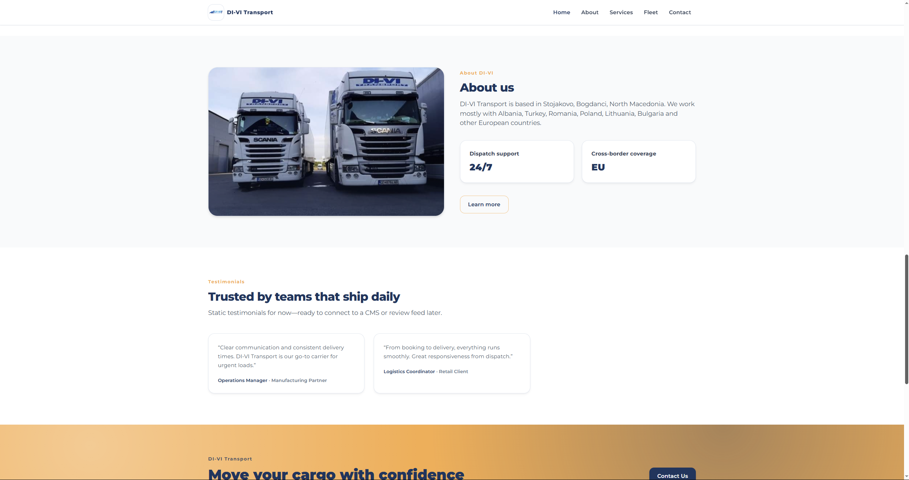
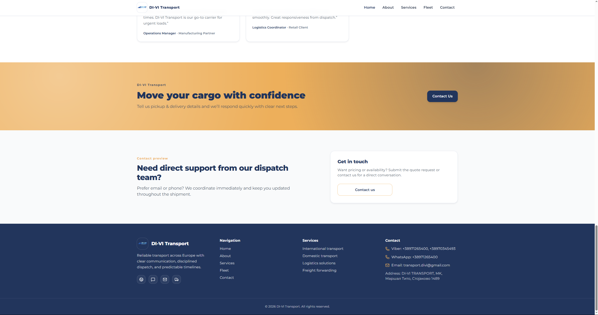
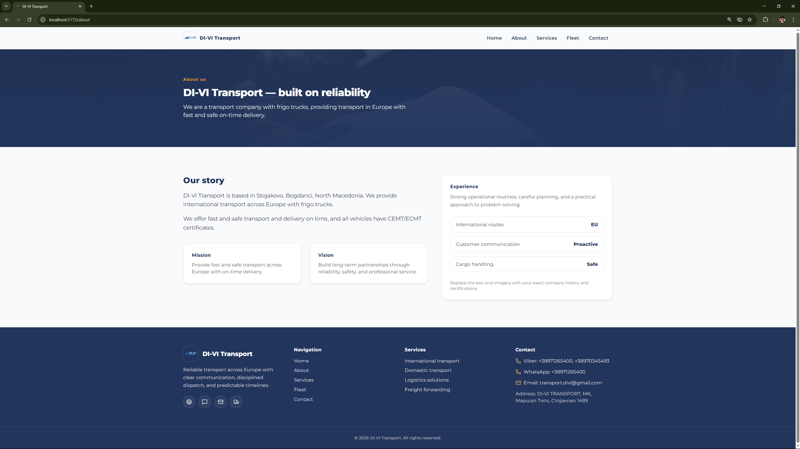
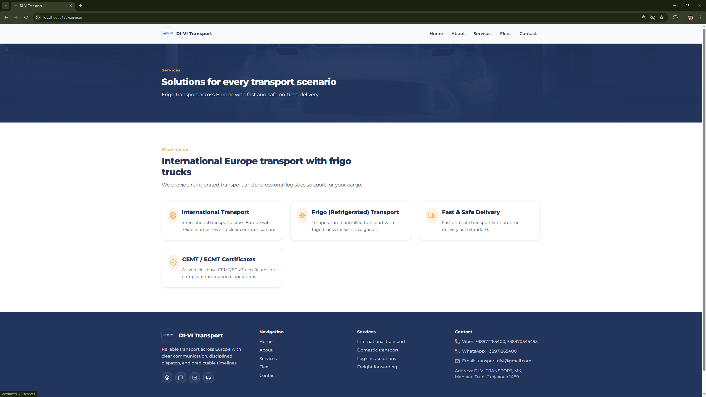
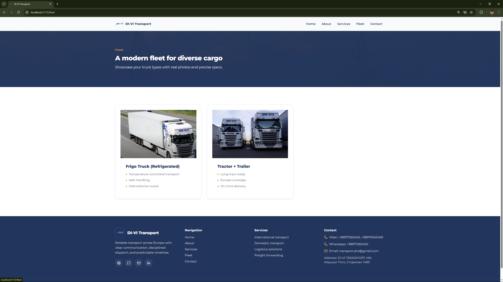
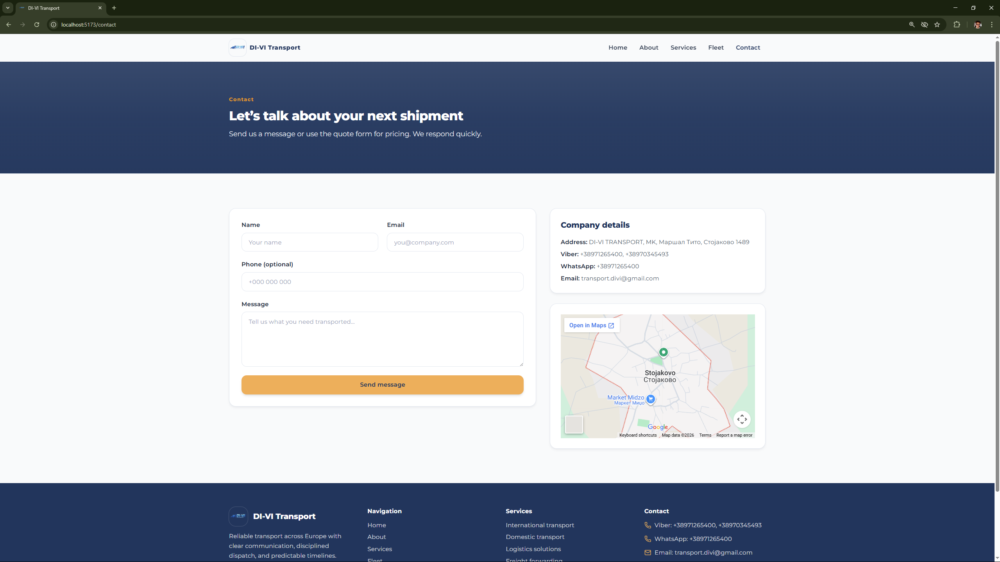

# DI‑VI Transport Website

This is a modern, visually polished truck transport website built with a full‑stack architecture (Node.js backend and React/Vite frontend).
The project presents DI‑VI Transport’s services and fleet with a clean, responsive design, and lets visitors contact the company directly through a contact form that sends their messages to the company’s email.

---

## 🚀 Features

- **Responsive Design:** Fully responsive layout that works well on desktop, tablet, and mobile.
- **Public Pages:** Home, About, Services, Fleet, and Contact routes for visitors.
- **Contact Form:** Visitors can submit their name, email, subject, and message.
- **Email Integration:** Form data is sent directly to the company email through the backend (e.g., using Nodemailer).
- **Clean UI:** Minimal, modern design with placeholder hero and fleet images that can be swapped for real truck photos.

---

## 🛠️ Tech Stack

- **Frontend:** React.js, Vite, Tailwind CSS (or similar), React Router
- **Backend:** Node.js, Express.js
- **Database:** MongoDB
- **Email Service:** Nodemailer (or a third‑party email API) to send contact messages

---

## 📦 Project Structure

- **di-vi_transport_site/
- **├── backend/  
- **├── frontend/  
- **└── screenShots/ 
  
---

## ⚙️ Installation & Setup

1. **Clone the repository:**
  ```
  git clone https://github.com/your-username/di-vi-transport.git
  cd di-vi-transport
  ```

2. **Set up the backend:**
   - Go to the backend folder:
     ```
     cd backend
     ```
   - Create `.env` with:
     ```
     MONGODB_URI=mongodb://127.0.0.1:27017/divi_transport
     EMAIL_USER=your-email@example.com
     EMAIL_PASS=your-email-password
     EMAIL_HOST=smtp.example.com
     EMAIL_PORT=587
     ```
   (Adjust host/port and auth based on your email provider.)

3. **Install dependencies and run servers:**
    **Backend:**
    ```
    cd backend
    npm install
    npm run dev
    ```

    **Frontend:**
    ```
    cd frontend
    npm install
    npm run dev
    ```

4. **Open the app:**
   - Frontend: http://localhost:5173
   - Backend: http://localhost:5000


---

## 📋 Usage

- Open the website in the browser and navigate to the Contact page.
- Fill out the contact form with a name, email, subject, and message and submit.
- The backend receives the submission and sends an email to the configured company address.
- Optional: If you keep MongoDB, you can also log contact messages in the database for later reference.

---

## 📸 Screenshots

### Home Page





### About Page


### Services Page


### Fleet Page


### Contact Page


---

## 🙏 Acknowledgements
- Node.js & Express – for building the backend API.
- React & Vite – for a fast and modern frontend.
- Nodemailer / SMTP provider – for sending contact emails.
- MongoDB – for optional data persistence.

---

> **Created and maintained by [Gjorgi Stamkov](https://github.com/gjorgistamkov).**
